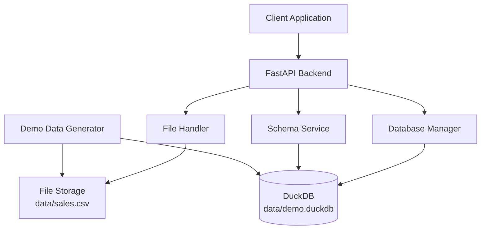

# Design Document

## Overview

The CSV Upload API extends the existing FastAPI backend to support CSV file ingestion and database schema introspection. This design builds upon the current DuckDB integration and adds two new endpoints: `/api/upload` for CSV processing and `/api/schema` for database metadata retrieval. The implementation follows the existing project architecture while adding robust file handling, data validation, and error management capabilities.

## Architecture

### High-Level Architecture



### Request Flow

1. **Upload Flow**: Client → `/api/upload` → File Validation → CSV Processing → DuckDB Ingestion → Response
2. **Schema Flow**: Client → `/api/schema` → Database Query → Metadata Extraction → Response
3. **Demo Flow**: Demo Script → CSV Generation → DuckDB Loading

## Components and Interfaces

### 1. FastAPI Application Structure

**Location**: `backend/src/main.py` (extending existing)

**New Endpoints**:

- `POST /api/upload` - CSV file upload and ingestion
- `GET /api/schema` - Database schema retrieval

**Dependencies Integration**:

- Extends existing FastAPI app instance
- Reuses existing DuckDB connection pattern
- Maintains existing CORS configuration

### 2. File Upload Handler

**Responsibilities**:

- Validate uploaded CSV files
- Handle multipart form data processing
- Save files to designated storage location
- Support demo data flag processing

**Interface**:

```python
class FileUploadHandler:
    async def process_upload(self, file: UploadFile, use_demo: bool = False) -> UploadResult
    def validate_csv_file(self, file: UploadFile) -> bool
    def save_csv_file(self, file: UploadFile, target_path: str) -> None
```

### 3. Database Manager

**Responsibilities**:

- CSV to DuckDB ingestion
- Table creation and data loading
- Connection management
- Query execution for schema operations

**Interface**:

```python
class DatabaseManager:
    def __init__(self, db_path: str)
    def ingest_csv(self, csv_path: str, table_name: str) -> TableMetadata
    def get_schema(self) -> DatabaseSchema
    def get_table_info(self, table_name: str) -> TableInfo
```

### 4. Schema Service

**Responsibilities**:

- Extract database metadata
- Format schema information for API responses
- Provide sample data for tables

**Interface**:

```python
class SchemaService:
    def get_all_tables_schema(self) -> Dict[str, Any]
    def get_table_columns(self, table_name: str) -> List[ColumnInfo]
    def get_sample_rows(self, table_name: str, limit: int = 5) -> List[Dict]
```

### 5. Demo Data Generator

**Location**: `scripts/init_demo.py`

**Responsibilities**:

- Generate realistic sales data
- Create CSV file with 500 sample rows
- Initialize DuckDB with demo data
- Ensure directory structure exists

## Data Models

### Request/Response Models

```python
# Upload Response
class UploadResponse(BaseModel):
    table: str
    columns: List[ColumnInfo]

class ColumnInfo(BaseModel):
    name: str
    type: str

# Schema Response
class DatabaseSchema(BaseModel):
    tables: Dict[str, TableSchema]

class TableSchema(BaseModel):
    name: str
    columns: List[ColumnInfo]
    sample_rows: List[Dict[str, Any]]
    row_count: int

# Error Response
class ErrorResponse(BaseModel):
    error: str
    detail: str
```

### Database Schema

**Sales Table Structure** (demo data):

```sql
CREATE TABLE sales (
    id INTEGER,
    date DATE,
    product_name VARCHAR,
    category VARCHAR,
    region VARCHAR,
    sales_amount DECIMAL(10,2),
    quantity INTEGER,
    customer_id INTEGER
);
```

## Error Handling

### Error Categories

1. **File Upload Errors** (HTTP 400):

   - Invalid file format
   - File too large
   - Missing file parameter
   - Corrupted CSV data

2. **Database Errors** (HTTP 500):

   - DuckDB connection failures
   - CSV ingestion errors
   - Schema query failures
   - Disk space issues

3. **Validation Errors** (HTTP 422):
   - Invalid request parameters
   - Malformed CSV structure

### Error Response Format

```python
{
    "error": "upload_failed",
    "detail": "CSV file contains invalid data format",
    "status_code": 400
}
```

### Exception Handling Strategy

- Use FastAPI's HTTPException for consistent error responses
- Implement custom exception classes for domain-specific errors
- Log all errors for debugging while returning safe messages to clients
- Graceful degradation for non-critical failures

## File Storage Strategy

### Directory Structure

```
data/
├── demo.duckdb          # DuckDB database file
├── sales.csv            # Uploaded/demo CSV file
└── uploads/             # Future: multiple file support
```

### File Management

- Overwrite existing `sales.csv` on new uploads (MVP approach)
- Ensure atomic file operations to prevent corruption
- Validate file permissions and disk space before operations
- Clean up temporary files on upload failures

## Testing Strategy

### Unit Tests Structure

**Location**: `backend/tests/`

**Test Categories**:

1. **API Endpoint Tests**:

   - Test `/api/upload` with valid CSV files
   - Test `/api/upload` with demo flag
   - Test `/api/schema` response format
   - Test error scenarios and HTTP status codes

2. **Component Tests**:

   - File upload handler validation
   - Database manager CSV ingestion
   - Schema service metadata extraction

3. **Integration Tests**:
   - End-to-end upload → schema retrieval flow
   - Demo data generation → API interaction
   - Database persistence across requests

### Test Data Strategy

- Use pytest fixtures for test database setup
- Generate small test CSV files for upload testing
- Mock external dependencies where appropriate
- Test with various CSV formats and edge cases

### Test Implementation

```python
# Example test structure
class TestUploadAPI:
    def test_upload_valid_csv(self, client, sample_csv)
    def test_upload_demo_data(self, client)
    def test_upload_invalid_file(self, client)

class TestSchemaAPI:
    def test_get_schema_with_data(self, client, populated_db)
    def test_get_schema_empty_db(self, client)
```

## Performance Considerations

### CSV Processing

- Stream large CSV files to avoid memory issues
- Use DuckDB's native CSV import for optimal performance
- Implement file size limits to prevent resource exhaustion

### Database Operations

- Reuse existing DuckDB connection from main application
- Use prepared statements for repeated operations
- Implement connection pooling if needed for concurrent requests

### Response Optimization

- Limit sample rows in schema responses (default: 5 rows)
- Use pagination for large result sets in future iterations
- Compress responses for large schema data

## Security Considerations

### File Upload Security

- Validate file extensions and MIME types
- Scan uploaded content for malicious patterns
- Implement file size limits
- Sanitize file names to prevent path traversal

### Database Security

- Use parameterized queries to prevent SQL injection
- Limit database operations to read/write on specific tables
- Validate CSV column names against allowed patterns
- Implement rate limiting for upload endpoints

### Error Information Disclosure

- Return generic error messages to clients
- Log detailed error information server-side only
- Avoid exposing internal file paths or database details
