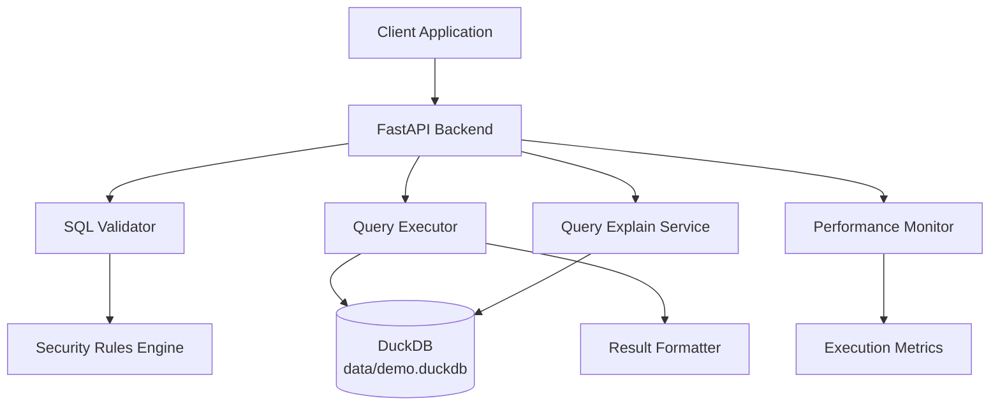

# Design Document

## Overview

The SQL Execution API provides a secure and performant interface for executing validated SQL queries against the DuckDB database. This design extends the existing FastAPI backend with two new endpoints: `/api/execute` for query execution and `/api/execute/explain` for query cost estimation. The implementation emphasizes security through strict SQL validation, performance monitoring through execution timing, and robust error handling to ensure system stability.

## Architecture

### High-Level Architecture



### Request Flow

1. **Execute Flow**: Client → `/api/execute` → SQL Validation → Query Execution → Performance Monitoring → Response Formatting → Client
2. **Explain Flow**: Client → `/api/execute/explain` → SQL Validation → Query Analysis → Execution Plan → Client
3. **Error Flow**: Any Step → Error Handler → Structured Error Response → Client

## Components and Interfaces

### 1. FastAPI Application Extension

**Location**: `backend/src/main.py` (extending existing)

**New Endpoints**:

- `POST /api/execute` - SQL query execution
- `GET /api/execute/explain` - Query cost estimation and execution plan

**Dependencies Integration**:

- Extends existing FastAPI app instance
- Reuses existing DuckDB connection pattern
- Maintains existing CORS and security configuration

### 2. SQL Validator

**Responsibilities**:

- Parse and validate SQL queries for security compliance
- Enforce read-only SELECT statement restrictions
- Detect and block dangerous SQL patterns
- Provide detailed validation error messages

**Interface**:

```python
class SQLValidator:
    def validate_query(self, sql: str) -> ValidationResult
    def is_select_only(self, sql: str) -> bool
    def check_dangerous_patterns(self, sql: str) -> List[SecurityViolation]
    def parse_sql_statement(self, sql: str) -> ParsedQuery

class ValidationResult:
    is_valid: bool
    errors: List[str]
    warnings: List[str]
    parsed_query: Optional[ParsedQuery]
```

### 3. Query Executor

**Responsibilities**:

- Execute validated SQL queries against DuckDB
- Manage query timeouts and resource limits
- Handle concurrent query execution
- Format query results for API responses

**Interface**:

```python
class QueryExecutor:
    def __init__(self, db_connection: DuckDBConnection)
    def execute_query(self, sql: str, timeout: int = 30) -> QueryResult
    def execute_with_limits(self, sql: str, max_rows: int = 10000) -> QueryResult
    def format_results(self, raw_results: Any) -> FormattedResults

class QueryResult:
    columns: List[str]
    rows: List[List[Any]]
    row_count: int
    runtime_ms: float
    truncated: bool = False
```

### 4. Performance Monitor

**Responsibilities**:

- Measure query execution times
- Track performance metrics
- Log slow queries for optimization
- Provide execution statistics

**Interface**:

```python
class PerformanceMonitor:
    def start_timing(self) -> TimingContext
    def record_execution(self, sql: str, runtime_ms: float, success: bool) -> None
    def get_performance_stats(self) -> PerformanceStats
    def is_slow_query(self, runtime_ms: float) -> bool

class TimingContext:
    def __enter__(self) -> 'TimingContext'
    def __exit__(self, exc_type, exc_val, exc_tb) -> None
    def get_elapsed_ms(self) -> float
```

### 5. Query Explain Service

**Responsibilities**:

- Generate query execution plans using DuckDB's EXPLAIN
- Estimate query costs and resource requirements
- Provide query optimization suggestions
- Format explanation results for API responses

**Interface**:

```python
class QueryExplainService:
    def explain_query(self, sql: str) -> ExplanationResult
    def estimate_cost(self, sql: str) -> CostEstimate
    def get_execution_plan(self, sql: str) -> ExecutionPlan

class ExplanationResult:
    execution_plan: str
    estimated_cost: float
    estimated_rows: int
    optimization_suggestions: List[str]
```

## Data Models

### Request/Response Models

```python
# Execute Request
class ExecuteRequest(BaseModel):
    sql: str

# Execute Response
class ExecuteResponse(BaseModel):
    columns: List[str]
    rows: List[List[Any]]
    row_count: int
    runtime_ms: float
    truncated: bool = False

# Explain Response
class ExplainResponse(BaseModel):
    execution_plan: str
    estimated_cost: float
    estimated_rows: int
    estimated_runtime_ms: float
    optimization_suggestions: List[str]

# Error Response
class SQLErrorResponse(BaseModel):
    error: str
    detail: str
    sql_error_type: str  # "syntax", "security", "execution", "timeout"
    position: Optional[int] = None  # For syntax errors
```

### Internal Data Models

```python
class ParsedQuery:
    query_type: str  # "SELECT", "INSERT", etc.
    tables: List[str]
    columns: List[str]
    has_joins: bool
    has_aggregations: bool
    complexity_score: int

class SecurityViolation:
    violation_type: str
    description: str
    severity: str  # "error", "warning"
    position: Optional[int] = None
```

## Error Handling

### Error Categories

1. **SQL Validation Errors** (HTTP 400):

   - Invalid SQL syntax
   - Security violations (non-SELECT statements)
   - Dangerous patterns detected
   - Malformed queries

2. **Execution Errors** (HTTP 400):

   - Table or column not found
   - Data type mismatches
   - Constraint violations
   - Invalid function usage

3. **Performance Errors** (HTTP 408/429):

   - Query timeout exceeded
   - Resource limits exceeded
   - Too many concurrent queries
   - Result set too large

4. **System Errors** (HTTP 500):
   - Database connection failures
   - Internal server errors
   - Memory allocation failures
   - Unexpected exceptions

### Error Response Strategy

```python
# Structured error responses with context
{
    "error": "sql_validation_failed",
    "detail": "DDL operations are not allowed",
    "sql_error_type": "security",
    "position": null,
    "suggestions": ["Use SELECT statements only"]
}

{
    "error": "query_execution_failed",
    "detail": "Table 'invalid_table' does not exist",
    "sql_error_type": "execution",
    "position": 15,
    "suggestions": ["Check available tables with /api/schema"]
}
```

## Security Implementation

### SQL Validation Rules

1. **Whitelist Approach**:

   - Only SELECT statements allowed
   - Specific function whitelist for safety
   - Table name validation against known schemas

2. **Pattern Detection**:

   ```python
   DANGEROUS_PATTERNS = [
       r'\b(CREATE|DROP|ALTER|INSERT|UPDATE|DELETE)\b',
       r'\b(PRAGMA|ATTACH|DETACH)\b',
       r'\b(LOAD|INSTALL)\b',
       r'--|\*\/|\*\*',  # Comment patterns
       r';.*\w',  # Multiple statements
   ]
   ```

3. **Query Complexity Limits**:
   - Maximum number of JOINs
   - Maximum subquery depth
   - Maximum WHERE clause complexity

### Input Sanitization

- SQL injection prevention through parameterized queries where possible
- Input length limits to prevent DoS attacks
- Character encoding validation
- Query normalization for consistent processing

## Performance Optimization

### Query Execution

1. **Connection Management**:

   - Reuse existing DuckDB connection pool
   - Connection timeout handling
   - Automatic connection recovery

2. **Result Set Management**:

   ```python
   # Streaming results for large datasets
   def execute_streaming(self, sql: str) -> Iterator[List[Any]]:
       cursor = self.connection.execute(sql)
       while True:
           batch = cursor.fetchmany(1000)
           if not batch:
               break
           yield batch
   ```

3. **Memory Management**:
   - Result set size limits (10,000 rows default)
   - Memory usage monitoring
   - Garbage collection for large queries

### Caching Strategy

1. **Query Plan Caching**:

   - Cache EXPLAIN results for identical queries
   - TTL-based cache invalidation
   - Memory-efficient storage

2. **Schema Caching**:
   - Cache table metadata for validation
   - Invalidate on schema changes
   - Shared cache with schema endpoint

## Monitoring and Logging

### Performance Metrics

```python
class QueryMetrics:
    total_queries: int
    successful_queries: int
    failed_queries: int
    average_runtime_ms: float
    slow_queries_count: int
    timeout_count: int
```

### Logging Strategy

1. **Query Logging**:

   ```python
   logger.info(f"Query executed: {sql[:100]}... Runtime: {runtime_ms}ms")
   logger.warning(f"Slow query detected: {runtime_ms}ms > {threshold}ms")
   logger.error(f"Query failed: {error_message}")
   ```

2. **Security Logging**:
   ```python
   logger.warning(f"Security violation: {violation_type} in query: {sql}")
   logger.error(f"Potential SQL injection attempt: {suspicious_pattern}")
   ```

## Testing Strategy

### Unit Tests Structure

**Location**: `backend/tests/test_sql_execution.py`

**Test Categories**:

1. **SQL Validation Tests**:

   ```python
   def test_valid_select_query()
   def test_reject_ddl_statements()
   def test_reject_dml_statements()
   def test_dangerous_pattern_detection()
   ```

2. **Query Execution Tests**:

   ```python
   def test_execute_simple_select()
   def test_execute_with_joins()
   def test_query_timeout_handling()
   def test_result_set_limits()
   ```

3. **Performance Tests**:

   ```python
   def test_execution_timing()
   def test_concurrent_queries()
   def test_memory_usage_limits()
   ```

4. **Error Handling Tests**:
   ```python
   def test_syntax_error_handling()
   def test_table_not_found_error()
   def test_timeout_error_response()
   ```

### Integration Tests

```python
class TestSQLExecutionIntegration:
    def test_end_to_end_query_execution(self, client, populated_db)
    def test_explain_endpoint_integration(self, client)
    def test_error_handling_integration(self, client)
    def test_performance_monitoring_integration(self, client)
```

### Test Data Strategy

- Use pytest fixtures for test database setup
- Generate test queries of varying complexity
- Mock timeout scenarios for testing
- Test with realistic data volumes

## Configuration

### Environment Variables

```python
# Query execution limits
QUERY_TIMEOUT_SECONDS = 30
MAX_RESULT_ROWS = 10000
SLOW_QUERY_THRESHOLD_MS = 1000

# Security settings
ENABLE_QUERY_LOGGING = True
STRICT_VALIDATION_MODE = True

# Performance settings
MAX_CONCURRENT_QUERIES = 10
ENABLE_QUERY_CACHING = True
```

### Runtime Configuration

```python
class SQLExecutionConfig:
    timeout_seconds: int = 30
    max_rows: int = 10000
    slow_query_threshold: int = 1000
    enable_explain: bool = True
    strict_validation: bool = True
```

## Future Enhancements

### Query Optimization

- Query rewriting for performance
- Automatic index suggestions
- Query result caching
- Prepared statement support

### Advanced Features

- Query history and favorites
- Query scheduling and batching
- Real-time query monitoring dashboard
- Query performance analytics

### Security Enhancements

- Role-based query access control
- Query audit trails
- Advanced threat detection
- Query rate limiting per user
